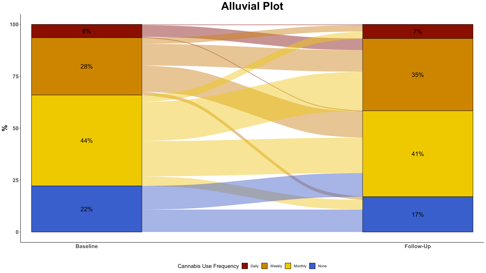
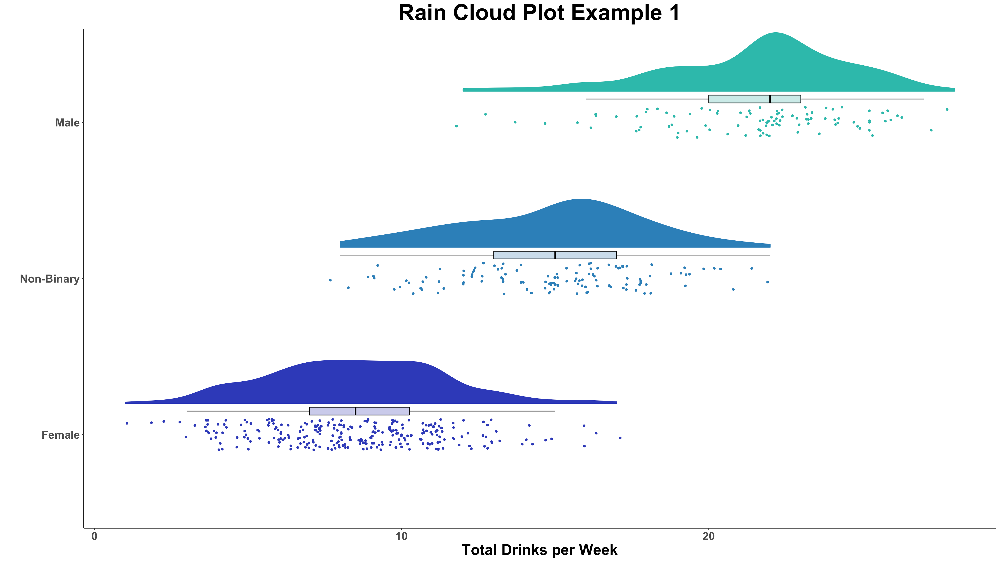
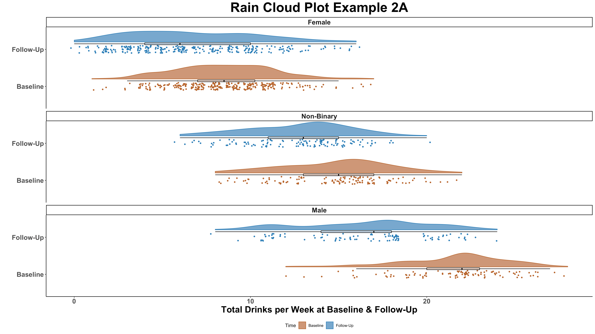
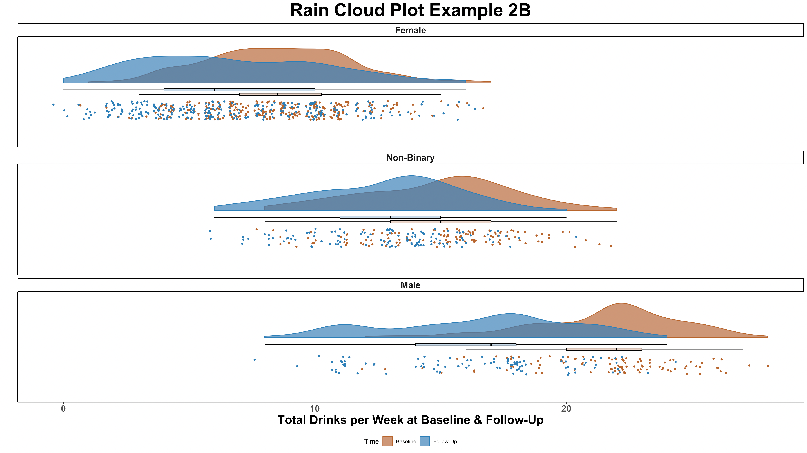
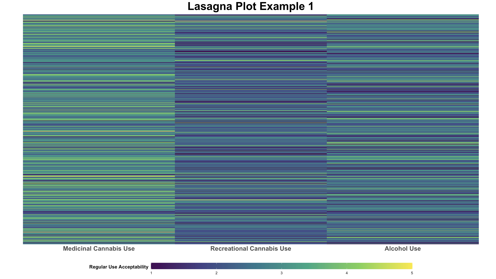
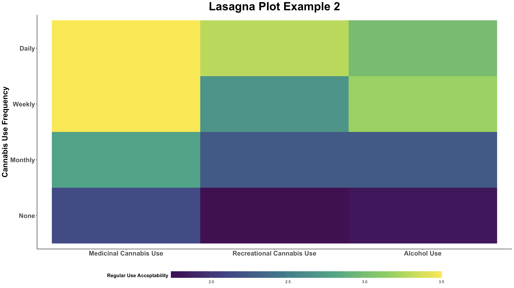

# Visualizations

A repository of scripts that can be used to reproduce some of the individual-level data visualization techniques that are popular at PBCAR. The corresponding example figures were created from the scripts themselves, making it easy to see what parts of the code correspond to the produced visualization.

These scripts accompany a small mock data set in wide format. The data set consists of 500 hypothetical participants whose data were collected at baseline, with follow-up data available for cannabis and alcohol outcomes. The variables are as follows:

| Variable      | Definition                                                                                                            |
|---------------|-----------------------------------------------------------------------------------------------------------------------|
| id            | participant id                                                                                                        |
| gender        | Gender at baseline (t1): 0 = Male; 1 = Female; 2 = Non-Binary                                                         |
| age           | Age in years at baseline (t1)                                                                                         |
| cig_smoker    | 0 = Non-Smoker; 1 = Smoker at baseline (t1)                                                                           |
| number_cigs   | Number of cigarettes smoked on average per day at baseline (t1)                                                       |
| cann_assist1  | Frequency of typical cannabis use at baseline (t1): 0 = None; 1 = Monthly; 2 = Weekly; 3 = Daily                      |
| cann_assist2  | Frequency of typical cannabis use at follow-up (t2): 0 = None; 1 = Monthly; 2 = Weekly; 3 = Daily                     |
| drink_days1   | Typical number of drinking days per week at baseline (t1)                                                             |
| drink_days2   | Typical number of drinking days per week at follow-up (t2)                                                            |
| total_drinks1 | Number of drinks consumed on average per week at baseline (t1)                                                        |
| total_drinks2 | Number of drinks consumed on average per week at follow-up (t2)                                                       |
| perception1   | Perception of regular medicinal cannabis use from 1 = 'Not at all Acceptable' to 5 = Completely Acceptable            |
| perception2   | Perception of regular recreational cannabis use from 1 = 'Not at all Acceptable' to 5 = 'Completely Acceptable'       |
| perception3   | Perception of regular alcohol use from 1 = 'Not at all Acceptable' to 5 = 'Completely Acceptable'                     |


In the scripts, this mock data set is assigned the name 'data.viz', assuming the .csv file is downloaded and saved to the set working directory. However, for ease of access, the data can be downloaded directly from this GitHub and imported into the R environment by using the following code:

```{r}
data.viz <- read.csv("https://raw.githubusercontent.com/PBCAR/Visualizations/main/data/PBCAR_Mock_Data.csv")
```

Any modifications made to the data structure or variables themselves are documented in the examples for completeness. Therefore, any of the visualizations produced in this repository can be reproduced.

# The Grammar of Graphics

All visualizations are produced by [ggplot2](https://github.com/tidyverse/ggplot2), as well as ggplot2 [extension packages](https://exts.ggplot2.tidyverse.org/gallery/). The ggplot2 package is based on the grammar of graphics, providing a systematic way to approach data visualization. For further information on how to customize ggplot2, the cheat sheet can be consulted:

<a href="https://github.com/rstudio/cheatsheets/blob/master/data-visualization.pdf"></a>

### Data Format (1 Observation per Row)

The grammar of graphics requires that data are in a format whereby 1 observation occupies 1 row. Thus, if data are in a wide format, such as the mock data, then the data must be changed to long format prior to using time as a category. Examples of how to do this are available in relevant scripts where this may be required (Rain Cloud Plots and Alluvial Scripts). Details of reshaping data are provided in detail below:

```{r}
dviz <- reshape(as.data.frame(data.viz), idvar = "id", timevar = "time",
                varying = c("total_drinks1","total_drinks2","drink_days1","drink_days2",
                            "cann_assist1","cann_assist2"),
                direction = "long", sep = "")
```

In the above code, the 'data.viz' mock data are reshaped to long format. The `idvar` identifies the unit of observations which have multiple rows in the long format. In this instance, it is the 'id' variable as each participant has two observations for each cannabis and alcohol outcome. The name of the variable to denote time is identified by the `timevar` argument. This will create a new column named 'time' and will identify which time point the observations come from. The variables which are measured repeatedly are identified using the `varying` argument. Since the numeric suffix of these variables is used to distinguish the time point from which they originate from, the `sep` argument is used to denote that there is no separating character used to distinguish between the main variable name and the suffix (unlike a suffix separator of "_", for example). When these variables are changed to the long format, their suffixes ("1","2") (and their suffix separators if applicable) are dropped, and each id has two rows of data - one with a value of "1" and another row with a value of "2" in the "time" variable.

### Custom Colour Palettes

There are a plethora of colour-palettes available for use as R packages, many of which are colour-blind friendly. Some to consult are the [viridis](https://github.com/sjmgarnier/viridis) package and the [RColorBrewer](http://colorbrewer2.org/) package, among many others. There are also the base R colours which, called by their names such as 'skyblue' or 'goldenrod2'. Alternatively, hexdecimal ('hex') colour codes are 6-digit alpha-numeric codes which can be used to create a custom colour-palette.

Custom palettes are easily adapted in visualizations, by using `scale_colour_manual()` for defined colour variables, and `scale_fill_manual()` for defined fill variables. There are also custom functions available from the packages themselves.

## Alluvial Plots (Sankey Plots)

The alluvial plot script ([alluvials.R](https://github.com/PBCAR/Visualizations/blob/main/scripts/alluvials.R)) contains the necessary data manipulation to create alluvial plots. Alluvial plots allow us to see the movement of participants between categories (in the example, cannabis use frequency) across time.



The script also walks users through changing their data into long format, and how to re-categorize their variables so that the alluvials are ordered from highest (top) to lowest category (bottom).

### Packages:

This script also uses the [dplyr](https://github.com/tidyverse/dplyr) and [ggalluvial](https://github.com/corybrunson/ggalluvial) packages.

## Rain Cloud Plots

Rain cloud plots are cited as a transparent approach to data visualization. To learn more about the original creators of this technique, see:

*Allen M, Poggiali D, Whitaker K et al. Raincloud plots: a multi-platform tool for robust data visualization [version 2; peer review: 2 approved]. Wellcome Open Res 2021, 4:63 (<https://doi.org/10.12688/wellcomeopenres.15191.2>)*

The rain cloud plot script ([rain_clouds.R](https://github.com/PBCAR/Visualizations/blob/main/scripts/rain_clouds.R)) in this repository provide a few different examples. The first example of a rain cloud plot has one categorical variable (gender) and one continuous variable (total drinks per week):



The second example has two versions of how to include a second categorical variable (in this instance, time):

A. The first category (gender) is faceted with time occupying different positions along the axis:



B. The first category (gender) is faceted with time occupying the same position along the axis:



The script also walks users through how to change their data into long format, as well as how to change the categories to factors prior to plotting.

### Packages:

This script also uses the [gghalves](https://github.com/erocoar/gghalves) package.

## Lasagna Plots

Lasagna plots are a great way to visualize the heterogeneity in data across variables on the same scale as one another. Lasagna 'layers' can be made up of either individual observations, or groups. The lasagna plot script ([rain_clouds.R](https://github.com/PBCAR/Visualizations/blob/main/scripts/lasagna.R)) in this repository provide an example of each grouping type.


The first example shows lasagna plots with individuals as layers. The first column 'Medicinal Cannabis Use' has more individuals with high acceptability of regular medicinal use than recreational use.



The second example layers the lasagna plot by the cannabis frequency variable at baseline, showing a mean average of acceptability that is higher for both medicinal and recreational cannabis use for those who use cannabis more regularly.



### Packages:

This script also uses the [dplyr](https://github.com/tidyverse/dplyr) package.

## Corset Plots

Corset plots are used to show the heterogeneity of change in repeat measures data at 2 time points. They can be made using the [ggcorset](https://github.com/kbelisar/ggcorset) package. To use this package, please refer to the downloading instructions and detailed examples provided with the package. Alternatively, an example has been provided with the mock data set:


### Example with the mock data set:

```{r}

library(ggcorset)

data.viz <- read.csv("https://raw.githubusercontent.com/PBCAR/Visualizations/main/data/PBCAR_Mock_Data.csv")

### Categorize age and change the age category to a factor

data.viz$age_cat <- ifelse(data.viz$age<30,0,
                        ifelse(data.viz$age>=30 & data.viz$age<40,1,2))

data.viz$age_cat <- factor(data.viz$age_cat, levels = c(0,1,2), labels = c("<30","30 - 39","40+"))

(plot <- gg_corset(data.viz, y_var1 = "total_drinks1", y_var2 = "total_drinks2", group = "id", c_var = "age_cat", 
                   eyelets = T, faceted = T, facet_design = "group", line_size = 0.5) +
        theme_ggcorset() + # a ggcorset theme!
        scale_colour_manual("Age Category", values = c("#879a87","#8da2bc","#b26666"))  + # custom colour
        scale_fill_manual("Age Category", values = c("#879a87","#8da2bc","#b26666"))  + # custom colour
        ggtitle("Change in Drinks per Week by Age Category") + # add a title to the corset plot
        xlab("") + # change x-axis title
        ylab("Total Drinks per Week") + # change y-axis title
        scale_x_discrete(labels = c("Baseline","Follow-Up")) + # change time labels
        guides(colour = guide_legend(override.aes = list(linewidth = 3)))) # modify legend                                       

```
